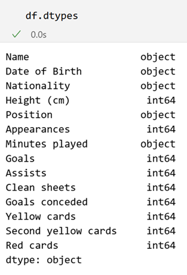
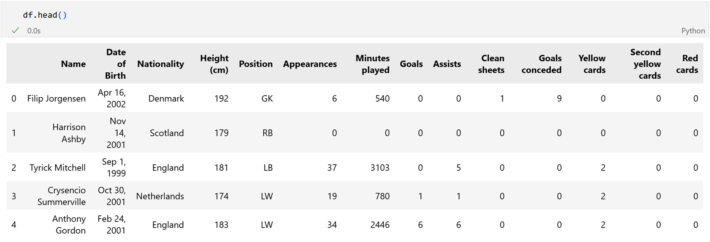

# ⚽ Football Player's Stats Scraping

A web scraping pipeline built in **Python** to extract structured football data from [Transfermarkt](https://www.transfermarkt.com). This tool allows you to select a league and season, then scrape all clubs, players, and individual player statistics such as goals, assists, minutes played, and more — stored in `.json` and `.xlsx` format.


---

## 🌟 Features

- 🌍 Choose any league and season (e.g. Premier League 2024)
- 🏟️ Scrape all club names and URLs from selected season
- 👥 Extract all players from each club with profile links
- 📊 Scrape individual player stats: Appearances, goals, assists, minutes played, etc.
- 🔁 Modular scraping in 3 stages (league → clubs → players)
---

## 🛠️ Built With

- Python
- BeautifulSoup
- Pandas

---

## 📸 Screenshots




---

## 📦 Installation

1. **Clone the repository**:

    ```bash
    git clone https://github.com/jordyyusim/football-players-scraping.git
    cd football-players-scraping
    ```

2. **Create a virtual environment**:

    ```bash
    python -m venv yourenv
    source yourenv/bin/activate      # On Windows: yourenv\Scripts\activate
    ```

3. **Install the dependencies**:

    ```bash
    pip install -r requirements.txt
    ```

4.  **Run the app**:
    - Scrape all clubs and players from a league. You'll need league, league code, and season year e.g. `premier-league`, `GB1`, `2024`
    ```bash
    python scrape_league.py
    ```

    - Scrape all players statistic. You need to select the specific competition's stats you want to extract e.g. Premier League
    ```bash
    python scrape_league.py
    ```
---

## 📬 Socials

[GitHub](https://github.com/jordyyusim)  | 
[LinkedIn](https://linkedin.com/in/jordyyusim)  | 
[X](https://x.com/jordyyusim)
